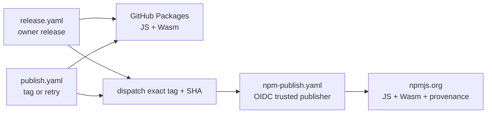

Every release uses one `X.Y.Z` version for all public artifacts:

* Maven Central: `com.fortemate:dicechess-engine_3`
* npmjs.org: `@fortemate/dicechess-engine` and `@fortemate/dicechess-engine-wasm`
* GitHub Packages: authenticated mirrors of both npm packages
* GitHub Release: JavaScript, TypeScript, and WebAssembly assets from tag `vX.Y.Z`

npmjs.org is the default JavaScript registry. GitHub Packages remains a mirror for consumers who
already use GitHub authentication.

## Release workflow architecture

The repository has two supported release entry points:

* `release.yaml` is the owner-triggered release workflow. It calculates the next version, validates
  the repository, creates the tag, publishes the registries, creates the GitHub Release, and opens
  the next-snapshot pull request.
* `publish.yaml` runs for a directly pushed tag and can be manually rerun at an existing tag. This is
  the recovery path after a partial release.

Both entry points build and verify the two packages, publish the GitHub Packages mirrors, then
dispatch `npm-publish.yaml` with the exact tag and commit SHA. They wait for that child run and fail
if it fails.



This separate dispatch is intentional. npm permits only one trusted publisher per package and
validates the **calling workflow** for reusable `workflow_call` jobs. A reusable workflow called by
both entry points would therefore present two different identities. A top-level
`workflow_dispatch` run always presents `npm-publish.yaml`, so both packages need exactly one trusted
publisher configuration. The dispatch API returns the canonical run ID, which lets the parent wait
for a definitive result.

`npm-publish.yaml` checks that the tag resolves to the supplied full SHA, checks out that tag, builds
both packages, verifies their tarballs and clean-project imports, and then publishes. Its job has
`id-token: write`; no npm write token is stored. Trusted Publishing supplies a short-lived OIDC
credential, and `npm publish --provenance` records build provenance.

## Idempotency and registry selection

Registry publication is not transactional. A failure can leave one destination complete and
another incomplete, so every retry checks the exact package and version separately:

* Maven Central checks the release POM at `https://repo1.maven.org/maven2/` before signing or
  publishing.
* Each GitHub Packages package uses an independent `npm view` against
  `https://npm.pkg.github.com`.
* Each npmjs.org package uses an independent `npm view` against
  `https://registry.npmjs.org`.

An exact match is skipped. A `404` is publishable. Authentication, network, or unexpected registry
errors stop the workflow instead of being mistaken for a missing version. Every `npm view` and
`npm publish` command carries an explicit registry URL; package metadata does not select a registry.

## Trusted publisher configuration

After each package exists on npmjs.org, its npm package owner configures the same GitHub Actions
trusted publisher:

| Field | Value |
| :--- | :--- |
| Organization or user | `fortemate` |
| Repository | `dicechess-engine` |
| Workflow filename | `npm-publish.yaml` |
| Environment | Leave empty |
| Allowed action | `npm publish` |

Apply this configuration independently to `@fortemate/dicechess-engine` and
`@fortemate/dicechess-engine-wasm`. The filename includes the `.yaml` extension and must match
exactly.

## Owner-run v0.4.0 npm bootstrap

`v0.4.0` predates npmjs.org publication. The first npmjs.org version must be published once by the
package owner before Trusted Publishing can be attached. Do not rerun `release.yaml`, create another
tag, or build from the current snapshot.

The exact `v0.4.0` commit is:

```text
26ce46306b3eeabfa875f6d5a7626098bccf3c89
```

Run the following from a clean checkout of `main` **after this npm publication change is merged**.
The detached worktree keeps all compiled source at the exact release tag while using the current
verification script only to inspect the generated packages.

### 1. Build and validate without npm credentials

```bash
IMPLEMENTATION_ROOT=$(git rev-parse --show-toplevel)
BOOTSTRAP_ROOT=$(mktemp -d)
BOOTSTRAP_SOURCE="$BOOTSTRAP_ROOT/v0.4.0"
EXPECTED_SHA=26ce46306b3eeabfa875f6d5a7626098bccf3c89

git fetch origin main tag v0.4.0
test "$(git rev-parse 'v0.4.0^{commit}')" = "$EXPECTED_SHA"
git worktree add --detach "$BOOTSTRAP_SOURCE" v0.4.0
cd "$BOOTSTRAP_SOURCE"

sbt 'rootJS/fullOptJS; rootWasm/fullLinkJS'
PACKAGE_VERSION=v0.4.0 bash .mise/tasks/package/prepare
PACKAGE_VERSION=v0.4.0 bash .mise/tasks/package/prepare-wasm

# The old tag targeted GitHub Packages and carried pre-flattening export paths. Normalize only
# the generated manifests; all compiled code and declarations remain from the exact tag.
jq '
  del(.publishConfig.registry) |
  .exports["."].types = "./dicechess-engine.d.ts" |
  .exports["."].import = "./dicechess-engine.js" |
  .exports["."].default = "./dicechess-engine.js"
' dist/package.json > dist/package.json.tmp
mv dist/package.json.tmp dist/package.json

jq '
  del(.publishConfig.registry) |
  .exports["."].types = "./dicechess-engine.d.ts" |
  .exports["."].import = "./main.js" |
  .exports["."].default = "./main.js"
' dist-wasm/package.json > dist-wasm/package.json.tmp
mv dist-wasm/package.json.tmp dist-wasm/package.json

bash "$IMPLEMENTATION_ROOT/.mise/tasks/package/verify" \
  "$BOOTSTRAP_SOURCE/dist" \
  "$BOOTSTRAP_SOURCE/dist-wasm"

mkdir "$BOOTSTRAP_ROOT/tarballs"
npm pack --pack-destination "$BOOTSTRAP_ROOT/tarballs" "$BOOTSTRAP_SOURCE/dist"
npm pack --pack-destination "$BOOTSTRAP_ROOT/tarballs" "$BOOTSTRAP_SOURCE/dist-wasm"
shasum -a 256 "$BOOTSTRAP_ROOT"/tarballs/*.tgz
```

Review the two `npm pack` manifests, checksums, names, and version before continuing. Both
`package.json` files must report `0.4.0`, the verification task must have imported both packages from
clean temporary consumer projects, and neither generated manifest may contain a registry override.

### 2. Human publication to npmjs.org

First make sure the exact versions are still absent. These checks require no credentials:

```bash
npm view '@fortemate/dicechess-engine@0.4.0' version --registry=https://registry.npmjs.org
npm view '@fortemate/dicechess-engine-wasm@0.4.0' version --registry=https://registry.npmjs.org
```

Both commands should return npm `E404`. If either returns `0.4.0`, do not republish that package.
The owner then uses an ephemeral npm configuration for the interactive, 2FA-protected bootstrap:

```bash
export NPM_CONFIG_USERCONFIG="$BOOTSTRAP_ROOT/npmrc"
npm login --registry=https://registry.npmjs.org --auth-type=web
npm whoami --registry=https://registry.npmjs.org

npm publish "$BOOTSTRAP_ROOT/tarballs/fortemate-dicechess-engine-0.4.0.tgz" \
  --registry=https://registry.npmjs.org --access=public
npm publish "$BOOTSTRAP_ROOT/tarballs/fortemate-dicechess-engine-wasm-0.4.0.tgz" \
  --registry=https://registry.npmjs.org --access=public

npm logout --registry=https://registry.npmjs.org
unset NPM_CONFIG_USERCONFIG
```

The one-time interactive bootstrap has no CI provenance. All later releases use OIDC and provenance
through `npm-publish.yaml`. After both packages are visible, configure their trusted publishers using
the table above, then verify the registry state explicitly:

```bash
npm view '@fortemate/dicechess-engine@0.4.0' version --registry=https://registry.npmjs.org
npm view '@fortemate/dicechess-engine-wasm@0.4.0' version --registry=https://registry.npmjs.org
git -C "$IMPLEMENTATION_ROOT" worktree remove "$BOOTSTRAP_SOURCE"
```

Delete the temporary bootstrap directory after retaining any checksums required for the release
record. Never copy the temporary npm configuration into the repository or a persistent dotfile.

## Initiating and recovering a release

For a new release, run `Ops: Release` from `main` and select `patch`, `minor`, or `major`. The human
owner reviews and merges the automatically opened next-snapshot pull request.

If a release stops after its tag exists, rerun `CD: Publish Package` at that exact tag. Do not advance
the version. Completed registry entries are skipped independently, and only missing artifacts are
published.
