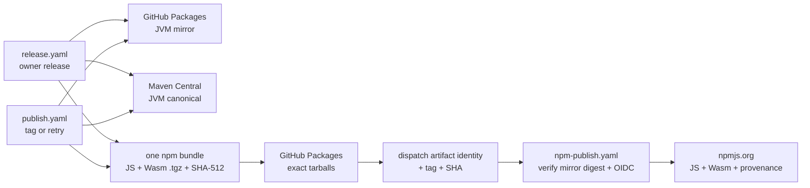

Every release uses one `X.Y.Z` version for all public artifacts:

* Maven Central: canonical `com.fortemate:dicechess-engine_3`
* npmjs.org: `@fortemate/dicechess-engine` and `@fortemate/dicechess-engine-wasm`
* GitHub Packages: authenticated mirrors of the JVM artifact and both npm packages
* GitHub Release: JavaScript, TypeScript, and WebAssembly assets from tag `vX.Y.Z`

Maven Central and npmjs.org are the public canonical registries. GitHub Packages remains a mirror
for consumers who already use GitHub authentication.

## Release workflow architecture

The repository has two supported release entry points:

* `release.yaml` is the owner-triggered release workflow. It calculates the next version, validates
  the repository, creates the tag, publishes the registries, creates the GitHub Release, and opens
  the next-snapshot pull request.
* `publish.yaml` runs for a directly pushed tag and can be manually rerun at an existing tag. This is
  the recovery path after a partial release.

Both entry points publish the JVM artifact to GitHub Packages and Maven Central from the same tag.
They also build each JavaScript package once, create one immutable npm release bundle, and record the
SHA-512 digest of its manifest and both tarballs. The entry point publishes those exact tarballs to
GitHub Packages, then dispatches `npm-publish.yaml` with the exact tag, commit SHA, source run,
artifact name, and manifest digest. It waits for that child run and fails if it fails.



This separate dispatch is intentional. npm permits only one trusted publisher per package and
validates the **calling workflow** for reusable `workflow_call` jobs. A reusable workflow called by
both entry points would therefore present two different identities. A top-level
`workflow_dispatch` run always presents `npm-publish.yaml`, so both packages need exactly one trusted
publisher configuration. The dispatch API returns the canonical run ID, which lets the parent wait
for a definitive result.

`npm-publish.yaml` checks that the tag resolves to the supplied full SHA and that the artifact came
from this repository's `release.yaml` or `publish.yaml` workflow. It downloads that immutable
cross-workflow artifact, verifies the supplied manifest SHA-512, recomputes both tarball digests,
installs both tarballs in clean temporary projects, and checks that the GitHub Packages copies expose
the same `dist.integrity` values. Only then does it publish those same `.tgz` files to npmjs.org. Its
job has `id-token: write`; no npm write token is stored. Trusted Publishing supplies a short-lived
OIDC credential, and `npm publish --provenance` records build provenance.

## Single npm artifact and digest enforcement

The workflow never asks npm to pack a release package independently for each registry. The parent
release entry point runs `npm pack` once per package and stores the resulting tarballs with a
`manifest.json` that binds all of the following values:

* the exact `vX.Y.Z` release tag and 40-character commit SHA;
* package name, version, tarball filename, and byte size;
* the hexadecimal SHA-512 digest and equivalent npm SRI `sha512-...` integrity value.

The Actions artifact is named `npm-release-<run-id>-<run-attempt>` and retained for 90 days. The
manifest SHA-512 and both package integrity values are written to the workflow summary. GitHub's
artifact download verifies the transport-level artifact digest; the repository scripts separately
verify the release manifest and every tarball after the cross-workflow handoff.

Every registry readback compares `dist.integrity` with the manifest. An already published version is
skipped only when its SHA-512 matches. A mismatch names the divergent package and fails closed. In
particular, `npm-publish.yaml` verifies both GitHub Packages mirror digests before it can publish
either package to npmjs.org, so the second immutable destination is never populated from a divergent
build.

## Idempotency and registry selection

Registry publication is not transactional. A failure can leave one destination complete and
another incomplete, so every retry checks the exact package and version separately:

* Maven Central checks the POM plus main, sources, and javadoc jars at
  `https://repo1.maven.org/maven2/` before signing or publishing.
* GitHub Packages checks the same authenticated JVM artifact set at
  `https://maven.pkg.github.com/` before publishing the Maven mirror.
* Each GitHub Packages package uses an independent `npm view` against
  `https://npm.pkg.github.com`.
* Each npmjs.org package uses an independent `npm view` against
  `https://registry.npmjs.org`.

An exact version-and-integrity match is skipped. A `404` is publishable. A version with a different
integrity, authentication failure, network failure, or unexpected registry response stops the
workflow instead of being mistaken for a missing version. Every `npm view` and `npm publish` command
carries an explicit registry URL; package metadata does not select a registry.

## Trusted publisher configuration

After each package exists on npmjs.org, its npm package owner configures the same GitHub Actions
trusted publisher:

| Field | Value |
| :--- | :--- |
| Organization or user | `fortemate` |
| Repository | `dicechess-engine` |
| Workflow filename | `npm-publish.yaml` |
| Environment | Leave empty |
| Allowed action | `npm publish` |

Apply this configuration independently to `@fortemate/dicechess-engine` and
`@fortemate/dicechess-engine-wasm`. The filename includes the `.yaml` extension and must match
exactly.

## Owner-run v0.4.0 npm bootstrap

`v0.4.0` predates npmjs.org publication. The first npmjs.org version must be published once by the
package owner before Trusted Publishing can be attached. Do not rerun `release.yaml`, create another
tag, or build from the current snapshot.

The exact `v0.4.0` commit is:

```text
26ce46306b3eeabfa875f6d5a7626098bccf3c89
```

Run the following from a clean checkout of `main` **after this npm publication change is merged**.
The detached worktree keeps all compiled source at the exact release tag while using the current
verification script only to inspect the generated packages.

### 1. Build and validate without npm credentials

```bash
IMPLEMENTATION_ROOT=$(git rev-parse --show-toplevel)
BOOTSTRAP_ROOT=$(mktemp -d)
BOOTSTRAP_SOURCE="$BOOTSTRAP_ROOT/v0.4.0"
EXPECTED_SHA=26ce46306b3eeabfa875f6d5a7626098bccf3c89

git fetch origin main tag v0.4.0
test "$(git branch --show-current)" = main
test -z "$(git status --porcelain)"
test "$(git rev-parse HEAD)" = "$(git rev-parse origin/main)"
test "$(git rev-parse 'v0.4.0^{commit}')" = "$EXPECTED_SHA"
git worktree add --detach "$BOOTSTRAP_SOURCE" v0.4.0
cd "$BOOTSTRAP_SOURCE"

sbt 'rootJS/fullOptJS; rootWasm/fullLinkJS'
PACKAGE_VERSION=v0.4.0 bash .mise/tasks/package/prepare
PACKAGE_VERSION=v0.4.0 bash .mise/tasks/package/prepare-wasm

# The old tag targeted GitHub Packages and carried pre-flattening export paths. Normalize only
# the generated manifests; all compiled code and declarations remain from the exact tag.
jq '
  del(.publishConfig.registry) |
  .exports["."].types = "./dicechess-engine.d.ts" |
  .exports["."].import = "./dicechess-engine.js" |
  .exports["."].default = "./dicechess-engine.js"
' dist/package.json > dist/package.json.tmp
mv dist/package.json.tmp dist/package.json

jq '
  del(.publishConfig.registry) |
  .exports["."].types = "./dicechess-engine.d.ts" |
  .exports["."].import = "./main.js" |
  .exports["."].default = "./main.js"
' dist-wasm/package.json > dist-wasm/package.json.tmp
mv dist-wasm/package.json.tmp dist-wasm/package.json

bash "$IMPLEMENTATION_ROOT/.mise/tasks/package/verify" \
  "$BOOTSTRAP_SOURCE/dist" \
  "$BOOTSTRAP_SOURCE/dist-wasm"

mkdir "$BOOTSTRAP_ROOT/tarballs"
npm pack --pack-destination "$BOOTSTRAP_ROOT/tarballs" "$BOOTSTRAP_SOURCE/dist"
npm pack --pack-destination "$BOOTSTRAP_ROOT/tarballs" "$BOOTSTRAP_SOURCE/dist-wasm"
shasum -a 256 "$BOOTSTRAP_ROOT"/tarballs/*.tgz
```

Review the two `npm pack` manifests, checksums, names, and version before continuing. Both
`package.json` files must report `0.4.0`, the verification task must have imported both packages from
clean temporary consumer projects, and neither generated manifest may contain a registry override.

### 2. Human publication to npmjs.org

First make sure the exact versions are still absent. These checks require no credentials:

```bash
npm view '@fortemate/dicechess-engine@0.4.0' version --registry=https://registry.npmjs.org
npm view '@fortemate/dicechess-engine-wasm@0.4.0' version --registry=https://registry.npmjs.org
```

Both commands should return npm `E404`. If either returns `0.4.0`, do not republish that package.
The owner then uses an ephemeral npm configuration for the interactive, 2FA-protected bootstrap:

```bash
export NPM_CONFIG_USERCONFIG="$BOOTSTRAP_ROOT/npmrc"
trap 'rm -f -- "$BOOTSTRAP_ROOT/npmrc"' EXIT
npm login --registry=https://registry.npmjs.org --auth-type=web
npm whoami --registry=https://registry.npmjs.org

npm publish "$BOOTSTRAP_ROOT/tarballs/fortemate-dicechess-engine-0.4.0.tgz" \
  --registry=https://registry.npmjs.org --access=public
npm publish "$BOOTSTRAP_ROOT/tarballs/fortemate-dicechess-engine-wasm-0.4.0.tgz" \
  --registry=https://registry.npmjs.org --access=public

npm logout --registry=https://registry.npmjs.org
rm -f -- "$BOOTSTRAP_ROOT/npmrc"
unset NPM_CONFIG_USERCONFIG
trap - EXIT
```

The one-time interactive bootstrap has no CI provenance. All later releases use OIDC and provenance
through `npm-publish.yaml`. After both packages are visible, configure their trusted publishers using
the table above, then verify the registry state explicitly:

```bash
npm view '@fortemate/dicechess-engine@0.4.0' version --registry=https://registry.npmjs.org
npm view '@fortemate/dicechess-engine-wasm@0.4.0' version --registry=https://registry.npmjs.org
git -C "$IMPLEMENTATION_ROOT" worktree remove "$BOOTSTRAP_SOURCE"
```

Delete the temporary bootstrap directory after retaining any checksums required for the release
record. Never copy the temporary npm configuration into the repository or a persistent dotfile.

## Initiating and recovering a release

For a new release, run `Ops: Release` from `main` and select `patch`, `minor`, or `major`. The human
owner reviews and merges the automatically opened next-snapshot pull request.

If a release stops after its tag exists, run the current `CD: Publish Package` workflow from `main`
and pass that exact tag as data:

```bash
RELEASE_TAG=vX.Y.Z
EXPECTED_RELEASE_SHA="<40-character commit recorded for that release>"
gh workflow run publish.yaml --ref main \
  -f release_tag="$RELEASE_TAG" \
  -f release_sha="$EXPECTED_RELEASE_SHA"
```

The workflow checks out the requested tag and requires both `HEAD` and the tag reference to equal the
independently recorded commit SHA. It derives every registry version from that tag. Do not move the
tag or advance the version. A complete registry entry is skipped, a completely absent one is
published, and a partial immutable version with a different digest fails closed for manual
investigation. The release and recovery workflows share one non-cancelling concurrency group, so they
cannot write the same coordinates at the same time. Before recovering a run created before that
concurrency guard existed, cancel it and confirm that it reached a terminal state.

If a run published only part of an npm release, reuse its original retained bundle instead of
rebuilding. Copy the source run ID, artifact name, and manifest SHA-512 from that run's **Immutable npm
release bundle** summary and provide all three recovery inputs together:

```bash
gh workflow run publish.yaml --ref main \
  -f release_tag="$RELEASE_TAG" \
  -f release_sha="$EXPECTED_RELEASE_SHA" \
  -f npm_artifact_run_id="<source-run-id>" \
  -f npm_artifact_name="npm-release-<source-run-id>-<run-attempt>" \
  -f npm_manifest_sha512="<128-character-hex-digest>"
```

The recovery workflow accepts bundles only from this repository's trusted release entry points,
verifies their tag/SHA binding and digests, restores GitHub Release assets from the tarballs, and
reconciles both registries. If the original artifact has expired, do not publish a newly rebuilt
tarball over a partial immutable release: the digest check will stop and the mismatch requires a new
version or explicit owner investigation.
