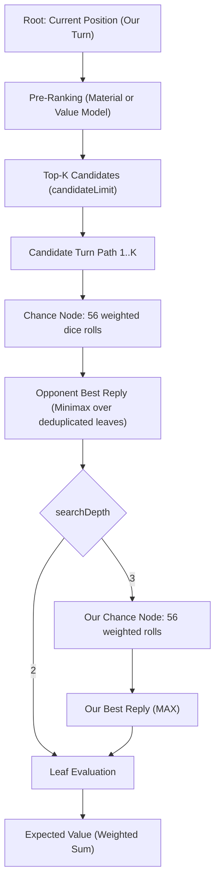

The **`ExpectimaxSearch`** algorithm (`dicechess.engine.search.ExpectimaxSearch`) provides configurable two- or three-ply lookahead in the Dice Chess engine, moving beyond single-turn heuristic bots (Levels 1–5) to reason about future turns, opponent replies, and our recaptures.

Unlike Minimax which assumes deterministic turns, Expectimax is designed for games with **chance nodes** — in Dice Chess, the stochastic dice rolls that determine which moves the opponent can play.

---

## Core Concepts

### Search Horizon

The default search depth is **two plies**:
1. **Ply 1 (Our Turn)**: The player selects a full-turn path (1–3 micro-moves).
2. **Chance Node**: The opponent's dice roll (56 unique combinations / 216 ordered outcomes).
3. **Ply 2 (Opponent Reply)**: The opponent chooses their best legal reply turn to minimize our evaluation.

With `searchDepth = 3`, every opponent reply adds a chance node over our next roll and a MAX node over our legal full-turn replies before leaf evaluation. This resolves the two-ply horizon's exchange blindness: the search sees both the opponent's capture and our recapture.

### Tree Structure



### Mathematical Expectation

At each chance node, the algorithm computes the expected value by weighting the opponent's best reply for each of the 56 unique dice combinations by its combinatorial probability:

$$E = \sum_{i=1}^{56} \frac{\text{weight}_i}{216} \times V(\text{roll}_i)$$

where $\sum_{i=1}^{56} \text{weight}_i = 216$.

---

## Implementation & Optimizations

### 1. Terminal Win Shortcut

If any of the active player's legal turn paths captures the opponent's king, the search immediately returns that turn with `SearchScoring.TerminalWinScore`. No candidate ranking or chance-node expansion is required.

### 2. Candidate Pre-Ranking

Dice Chess positions often offer hundreds of legal turn paths for a single roll. Expanding every path through 56 dice outcomes would be prohibitively slow.

Before expanding chance nodes, all legal paths are scored using a fast batched pre-ranker (`preRank`, defaulting to material balance via `ExpectimaxSearch.materialBatch`). Only the top `config.candidateLimit` candidates are expanded through full chance nodes.

### 3. Recursive Chance Nodes & Leaf Deduplication

For each weighted dice roll in a chance node:
1. All legal opponent reply paths are generated under the rolled dice pool.
2. If any reply captures our king, that roll immediately yields `LossValue` ($-10^9$) — below any evaluator's scale so the opponent always chooses it and we rank that line last.
3. At depth 2, the resulting positions are leaves. At depth 3, each result recursively enters our next chance/MAX layer.
4. Leaf positions are **deduplicated in-place** using `LeafKey` before evaluation.

> [!NOTE]
> **Leaf Deduplication vs Transposition Tables**: Dice Chess turns consist of 1–3 micro-moves. Independent micro-moves played in different orders often reach identical board states (~78% duplicate leaves per chance node). Because the opponent minimizes over leaves ($\min(S) = \min(\text{distinct}(S))$), duplicate boards can be dropped with zero loss of precision.
>
> Deduplication uses `LeafKey`, which packs 11 primitives (piece bitboards, en-passant, flags, full-move counter) and hashes them in 64-bit CPU registers without heap allocations. This is per-chance-node leaf compaction, not a cross-ply Transposition Table.

### 4. Batched Leaf Evaluation

The distinct leaf states under a roll are scored in a single call to `evalBatch(leaves, color)`. Scoring in batches eliminates per-leaf call overhead and enables vectorized or hardware-accelerated evaluation (e.g. via ONNX Runtime in [`OnnxExpectimaxSearch`](/dicechess-engine/architecture/search/07-onnx-integration/)).

### 5. Star Pruning (Star1 & Star2 Probing)

To avoid expanding full chance-node subtrees that cannot affect the enclosing decision window, `ExpectimaxSearch` uses two levels of star pruning:
- **Star1 Pruning**: As weighted dice rolls are processed in weight-descending order, upper and lower bounds on the remaining expectation are maintained. A node fails low when its strict upper bound is below $\alpha$, or fails high when its strict lower bound is above $\beta$.
- **Star2 Probing**: MIN chance nodes probe one opponent reply per roll for a tighter upper bound; MAX chance nodes probe one of our replies for a tighter lower bound. Leaf probes remain batched. At depth 3, recursive probe results and TT entries are reused when the full node is expanded.

The recursive bounds use `LossValue` as the safe lower limit and `WinValue = 10001` as the upper limit. `WinValue` is one point above the documented leaf-model ceiling, so a future king capture always dominates a non-terminal evaluation without widening the Star window to `Int.MaxValue`. Strict cutoffs preserve equal-valued candidates for the root's random tie-break.

### 6. Transposition Table

An optional `TranspositionTable` caches exact values and fail-soft upper/lower bounds with their remaining depth. Depth-3 inner MAX chance nodes use a role-salted key so the same board cannot collide with a MIN continuation evaluated from the opposite perspective. Deadline-aborted partial nodes are never stored.

### 7. Root Rescoring (`RootRescore`)

An optional `RootRescore` blends the chance-node search value with a second, tactically sharp but leaf-prohibitive evaluator computed once on the resulting candidate positions (before the opponent's roll):

$$\text{score} = (1 - w) \times V_{\text{search}} + w \times V_{\text{rescore}}$$

This allows expensive evaluations (such as 216-outcome King Capture Probability features) to run at the root ($K$ states) without burdening the thousands of leaves under chance nodes. Candidates tainted by an unavoidable king capture on any opponent roll are never rescored and remain ranked last.

The bounded root-rescore batch runs before chance-node expansion, but only while the wall-clock budget still has time remaining. The evaluator's batch API is indivisible: a batch that starts before the deadline cannot be interrupted safely, so the search checks the clock both before and immediately after it. An already-expired deadline skips rescoring entirely; a batch that consumes the remaining budget prevents chance-node work, and both cases preserve the pre-rank fallback and deadline-truncation telemetry.

After a candidate completes, its blended score becomes the root's best score. For each later candidate with `0 < w < 1`, the search converts that blended value back into the candidate's search-score domain:

$$\alpha_{\text{search}} = \frac{\alpha_{\text{final}} - w V_{\text{rescore}}}{1 - w}$$

Star1, Star2, and TT upper-bound checks all use this candidate-specific bound rather than comparing scores from different domains. The implementation rounds the transformed bound conservatively and retains strict `<` cutoffs so exact blended ties still reach the seeded random tie-break. It also caps the bound at the unblended best score until loss-taint status is known, because a loss-tainted candidate bypasses the blend.

`RootRescore.weight` accepts the closed interval `[0, 1]`. Weight `0` is exactly equivalent to omitting `RootRescore` and does not invoke its evaluator. At weight `1`, the final score of a non-loss-tainted candidate no longer depends on the search value, so no finite inverse exists; transformed root pruning is explicitly disabled while exact search still determines loss taint.

### 8. Time Management & Telemetry

`ExpectimaxSearch` extends `TimeBudgetedSearch` and coordinates with [`TimeManager`](/dicechess-engine/architecture/search/05-time-management/):
- **Fine-grained clock checks**: The deadline is checked **between dice rolls at every recursive chance node**, not merely between root candidates.
- **Anytime contract**: Truncated candidates (cut mid-expansion) are abandoned and discarded rather than compared against completed candidates. If the deadline expires before even one candidate completes, the search falls back to the pre-ranker's top pick.
- **Telemetry sink (`RootSearchStats`)**: An optional `statsSink` receives search diagnostics per move (`legalTurns`, `candidatesSelected`, `candidatesCompleted`, `candidatesAbandoned`, `cutoffs`, `rollsSaved`, `probeCutoffs`), reporting cutoff telemetry and deadline truncation.

---

## Configuration

```scala
final case class ExpectimaxConfig(
    candidateLimit: Int = 8,
    exactOnlyMode: Boolean = false,
    searchDepth: Int = 2
)
```

- `candidateLimit`: Bounds the branching factor at the root decision node. Must be positive. Widening `candidateLimit` grows search cost linearly.
- `exactOnlyMode`: Restricts TT reuse/stores to exact entries; useful for correctness comparisons.
- `searchDepth`: Selects the implemented two- or three-ply tree. Depth 2 is the compatibility default; other values are rejected.

---

## Bot Registry Integration

`ExpectimaxSearch` is **not** included in `BotRegistry`'s default built-in entries because it requires an injected `evalBatch` function. Hosts instantiate and register custom instances:

```scala
import dicechess.engine.domain.{Color, GameState}
import dicechess.engine.search.{BotInfo, BotRegistry, Evaluator, ExpectimaxConfig, ExpectimaxSearch}

val evalBatch = (states: Array[GameState], color: Color) =>
  states.map(Evaluator.evaluate(_, color))

val search = ExpectimaxSearch(
  evalBatch = evalBatch,
  config = ExpectimaxConfig(candidateLimit = 8, searchDepth = 3)
)

val registration = BotRegistry.registerCustomBot(
  BotInfo("expectimax", "Expectimax", "Configurable expectimax with chance nodes.", difficulty = 7, isExperimental = true),
  search
)
```

When finished, call `registration.close()` to unregister the bot and release associated resources.

### JavaScript API Usage

> [!WARNING]
> In the npm distribution (`@fortemate/dicechess-engine`), `ExpectimaxSearch` is not registered by default. Calling:
>
> ```javascript
> const result = DiceChess.getBestMove(dfen, { algorithm: "expectimax" });
> ```
>
> without previously registering a custom bot named `"expectimax"` will **silently fall back to the default algorithm (`Greedy (L3)`)**.

---

## Comparison with Primitive Bots

| Aspect | Primitive Bots (L1–5) | ExpectimaxSearch |
|---|---|---|
| **Horizon** | 1 turn (1–3 micro-moves) | 2 or 3 plies (optionally including our next reply) |
| **Opponent Modeling** | None (assumes random play or ignores opponent) | Minimax response (worst-case opponent reply) |
| **Probability Handling** | None | Exact expectation over 56 dice outcomes (216 rolls) |
| **Branching Control** | Eager enumeration of all legal paths | Root candidate pre-ranking (`candidateLimit`) |
| **Leaf Optimization** | Individual state evaluation | In-place leaf deduplication (`LeafKey`) + batched scoring |
| **Time Management** | Some support `TimeBudgetedSearch` | Fine-grained checks between rolls inside chance nodes |

---

## Roadmap & Future Optimizations

Star1/Star2, Zobrist/TT, and the first configurable depth increase are implemented. Remaining stages are documented in the [Search Roadmap & Evaluation](/dicechess-engine/architecture/search/03-search-roadmap/):

1. **Parallel Chance Nodes**: Concurrent branch evaluation across CPU cores.
2. **Depths beyond 3 & Iterative Deepening**: Deeper traversal within time budgets, after measurement establishes a viable cost envelope.

---

## See Also

- [Primitive Bot Strategies (Levels 1–5)](/dicechess-engine/architecture/search/01-primitive-search/) — Single-turn heuristic bots
- [ONNX Model Integration](/dicechess-engine/architecture/search/07-onnx-integration/) — `OnnxExpectimaxSearch` combining learned value models with Expectimax lookahead
- [Time Management](/dicechess-engine/architecture/search/05-time-management/) — Per-turn time budgets and deadline checking
- [Search Roadmap & Evaluation](/dicechess-engine/architecture/search/03-search-roadmap/) — Staged plans for pruning, transposition tables, and concurrency
