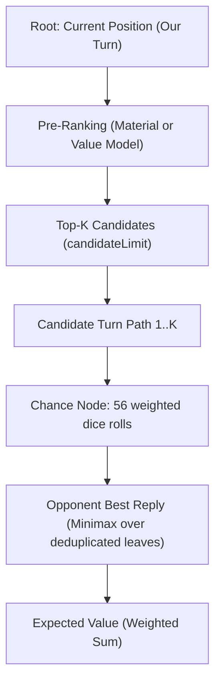

The **`ExpectimaxSearch`** algorithm (`dicechess.engine.search.ExpectimaxSearch`) provides two-ply lookahead search capability in the Dice Chess engine, moving beyond single-turn heuristic bots (Levels 1–5) to reason about future turns and opponent replies.

Unlike Minimax which assumes deterministic turns, Expectimax is designed for games with **chance nodes** — in Dice Chess, the stochastic dice rolls that determine which moves the opponent can play.

---

## Core Concepts

### Search Horizon

The search depth is **fixed at two plies**:
1. **Ply 1 (Our Turn)**: The player selects a full-turn path (1–3 micro-moves).
2. **Chance Node**: The opponent's dice roll (56 unique combinations / 216 ordered outcomes).
3. **Ply 2 (Opponent Reply)**: The opponent chooses their best legal reply turn to minimize our evaluation.

### Tree Structure



### Mathematical Expectation

At each chance node, the algorithm computes the expected value by weighting the opponent's best reply for each of the 56 unique dice combinations by its combinatorial probability:

$$E = \sum_{i=1}^{56} \frac{\text{weight}_i}{216} \times V(\text{roll}_i)$$

where $\sum_{i=1}^{56} \text{weight}_i = 216$.

---

## Implementation & Optimizations

### 1. Terminal Win Shortcut

If any of the active player's legal turn paths captures the opponent's king, the search immediately returns that turn with `SearchScoring.TerminalWinScore`. No candidate ranking or chance-node expansion is required.

### 2. Candidate Pre-Ranking

Dice Chess positions often offer hundreds of legal turn paths for a single roll. Expanding every path through 56 dice outcomes would be prohibitively slow.

Before expanding chance nodes, all legal paths are scored using a fast batched pre-ranker (`preRank`, defaulting to material balance via `ExpectimaxSearch.materialBatch`). Only the top `config.candidateLimit` candidates are expanded through full chance nodes.

### 3. Chance Node & Leaf Deduplication

For each weighted dice roll in the chance node:
1. All legal opponent reply paths are generated under the rolled dice pool.
2. If any reply captures our king, that roll immediately yields `LossValue` ($-10^9$) — below any evaluator's scale so the opponent always chooses it and we rank that line last.
3. Otherwise, resulting board positions are generated and **deduplicated in-place** using `LeafKey`.

> [!NOTE]
> **Leaf Deduplication vs Transposition Tables**: Dice Chess turns consist of 1–3 micro-moves. Independent micro-moves played in different orders often reach identical board states (~78% duplicate leaves per chance node). Because the opponent minimizes over leaves ($\min(S) = \min(\text{distinct}(S))$), duplicate boards can be dropped with zero loss of precision.
>
> Deduplication uses `LeafKey`, which packs 11 primitives (piece bitboards, en-passant, flags, full-move counter) and hashes them in 64-bit CPU registers without heap allocations. This is per-chance-node leaf compaction, not a cross-ply Transposition Table.

### 4. Batched Leaf Evaluation

The distinct leaf states under a roll are scored in a single call to `evalBatch(leaves, color)`. Scoring in batches eliminates per-leaf call overhead and enables vectorized or hardware-accelerated evaluation (e.g. via ONNX Runtime in [`OnnxExpectimaxSearch`](/dicechess-engine/architecture/search/07-onnx-integration/)).

### 5. Star Pruning (Star1 & Star2 Probing)

To avoid expanding full chance-node subtrees that cannot beat the current best candidate ($\alpha$), `ExpectimaxSearch` uses two levels of star pruning:
- **Star1 Pruning**: As weighted dice rolls are processed in weight-descending order, an upper bound on remaining expectation is maintained ($acc + P_{\text{rem}} \cdot U$). When $acc + P_{\text{rem}} \cdot U \le \alpha$, the remaining rolls are skipped.
- **Star2 Probing**: Before expanding a candidate's chance node, each of the 56 rolls is probed with a single top-1 opponent reply (pre-ranked by material). All 56 probed positions are evaluated in a single batched `evalBatch` call. If the probed upper bound sum satisfies $\sum p_i \cdot \text{probe}_i \le \alpha$, the candidate's chance node is pruned immediately without full per-roll expansion. If probing does not prune the node, the probed values serve as tighter per-roll ceilings during Star1 roll iteration.

### 6. Root Rescoring (`RootRescore`)

An optional `RootRescore` blends the chance-node search value with a second, tactically sharp but leaf-prohibitive evaluator computed once on the resulting candidate positions (before the opponent's roll):

$$\text{score} = (1 - w) \times V_{\text{search}} + w \times V_{\text{rescore}}$$

This allows expensive evaluations (such as 216-outcome King Capture Probability features) to run at the root ($K$ states) without burdening the thousands of leaves under chance nodes. Candidates tainted by an unavoidable king capture on any opponent roll are never rescored and remain ranked last.

### 7. Time Management & Telemetry

`ExpectimaxSearch` extends `TimeBudgetedSearch` and coordinates with [`TimeManager`](/dicechess-engine/architecture/search/05-time-management/):
- **Fine-grained clock checks**: The deadline is checked **between dice rolls inside the chance node** (~$1/56$ of a candidate), not merely between candidates.
- **Anytime contract**: Truncated candidates (cut mid-expansion) are abandoned and discarded rather than compared against completed candidates. If the deadline expires before even one candidate completes, the search falls back to the pre-ranker's top pick.
- **Telemetry sink (`RootSearchStats`)**: An optional `statsSink` receives search diagnostics per move (`legalTurns`, `candidatesSelected`, `candidatesCompleted`, `candidatesAbandoned`, `cutoffs`, `rollsSaved`, `probeCutoffs`), reporting cutoff telemetry and deadline truncation.

---

## Configuration

```scala
final case class ExpectimaxConfig(
    candidateLimit: Int = 8 // Number of pre-ranked turn paths expanded through chance nodes
)
```

- `candidateLimit`: Bounds the branching factor at the root decision node. Must be positive. Widening `candidateLimit` grows search cost linearly.

---

## Bot Registry Integration

`ExpectimaxSearch` is **not** included in `BotRegistry`'s default built-in entries because it requires an injected `evalBatch` function. Hosts instantiate and register custom instances:

```scala
import dicechess.engine.domain.{Color, GameState}
import dicechess.engine.search.{BotInfo, BotRegistry, Evaluator, ExpectimaxConfig, ExpectimaxSearch}

val evalBatch = (states: Array[GameState], color: Color) =>
  states.map(Evaluator.evaluate(_, color))

val search = ExpectimaxSearch(
  evalBatch = evalBatch,
  config = ExpectimaxConfig(candidateLimit = 8)
)

val registration = BotRegistry.registerCustomBot(
  BotInfo("expectimax", "Expectimax", "Two-ply expectimax with chance nodes.", difficulty = 7, isExperimental = true),
  search
)
```

When finished, call `registration.close()` to unregister the bot and release associated resources.

### JavaScript API Usage

> [!WARNING]
> In the npm distribution (`@fortemate/dicechess-engine`), `ExpectimaxSearch` is not registered by default. Calling:
>
> ```javascript
> const result = DiceChess.getBestMove(dfen, { algorithm: "expectimax" });
> ```
>
> without previously registering a custom bot named `"expectimax"` will **silently fall back to the default algorithm (`Greedy (L3)`)**.

---

## Comparison with Primitive Bots

| Aspect | Primitive Bots (L1–5) | ExpectimaxSearch |
|---|---|---|
| **Horizon** | 1 turn (1–3 micro-moves) | 2 plies (our turn + opponent reply) |
| **Opponent Modeling** | None (assumes random play or ignores opponent) | Minimax response (worst-case opponent reply) |
| **Probability Handling** | None | Exact expectation over 56 dice outcomes (216 rolls) |
| **Branching Control** | Eager enumeration of all legal paths | Root candidate pre-ranking (`candidateLimit`) |
| **Leaf Optimization** | Individual state evaluation | In-place leaf deduplication (`LeafKey`) + batched scoring |
| **Time Management** | Some support `TimeBudgetedSearch` | Fine-grained checks between rolls inside chance nodes |

---

## Roadmap & Future Optimizations

Planned search optimizations not yet implemented in `ExpectimaxSearch` are documented in the [Search Roadmap & Evaluation](/dicechess-engine/architecture/search/03-search-roadmap/):

1. **Transposition Tables & Zobrist Hashing**: Cross-node and cross-ply caching of search values and bounds.
3. **Parallel Chance Nodes**: Concurrent branch evaluation across CPU cores.
4. **Arbitrary Depth ($d > 2$) & Iterative Deepening**: Deep multi-ply tree traversal within time budgets.

---

## See Also

- [Primitive Bot Strategies (Levels 1–5)](/dicechess-engine/architecture/search/01-primitive-search/) — Single-turn heuristic bots
- [ONNX Model Integration](/dicechess-engine/architecture/search/07-onnx-integration/) — `OnnxExpectimaxSearch` combining learned value models with Expectimax lookahead
- [Time Management](/dicechess-engine/architecture/search/05-time-management/) — Per-turn time budgets and deadline checking
- [Search Roadmap & Evaluation](/dicechess-engine/architecture/search/03-search-roadmap/) — Staged plans for pruning, transposition tables, and concurrency