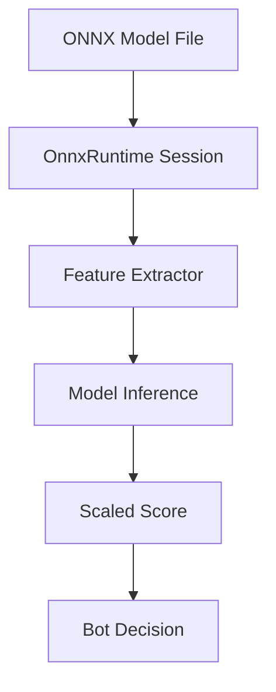

The Dice Chess engine supports **learned evaluation** via **ONNX (Open Neural Network Exchange)** models, enabling externally-trained value models to guide bot decision-making. This integration allows the engine to leverage machine learning models without embedding them in the codebase (models are passed as runtime files).

---

## Overview

ONNX integration provides two specialized bots:

1. **`OnnxEvalSearch`**: Uses ONNX model for leaf node evaluation in a shallow search
2. **`OnnxExpectimaxSearch`**: Combines ONNX evaluation with deep Expectimax search

Both bots are **JVM-only** (not available in JS/Wasm bundles due to ONNX Runtime dependency).

---

## Architecture



### Component Flow

1. **Model Loading**: ONNX model loaded via [ONNX Runtime Java API](https://github.com/microsoft/onnxruntime)
2. **Feature Extraction**: Board state converted to model input features via `OnnxFeatures`
3. **Inference**: Model evaluates position and returns win probability or score
4. **Integration**: Score combined with search algorithm's evaluation

---

## Feature Extraction

The engine implements several feature extractors in `shared/src/main/scala/dicechess/engine/search/`.
Each one is a versioned layout contract with a stable `schemaId`, and each is **mover-perspective and
dice-free**: `extract(state, color)` depends on the position and the color being scored, never on
which side is to move or on the current dice pool.

| `schemaId` | Columns | Extractor | Adds |
| --- | --- | --- | --- |
| `material-7-v1` | 7 | `OnnxFeatures` | piece-count differences, material difference and total |
| `rich-9-v1` | 9 | `RichFeatures` | `mobility_diff`, `king_safety_diff` |
| `rich-pdi-11-v1` | 11 | `RichPdiFeatures` | own/opponent piece-diversity indices |
| `kcp-13` | 13 | `KcpFeatures` | king and queen capture probabilities |
| `kcp-mobility-27-v1` | 27 | `KcpMobilityFeatures` | per-piece-type move counts, PDI |
| `kcp-mobility-pawns-31-v1` | 31 | `KcpMobilityPawnsFeatures` | passed-pawn columns |
| `raw-board-768-v1` | 768 | `RawBoardFeatures` | 12 piece planes × 64 squares |

The column names of each set are published as `columnNames` on the extractor, which is what training
enrichment writes its CSV header from — the layout has exactly one definition.

Cost, not width, decides where a set belongs: the four capture-probability columns of `kcp-13` each
integrate over the 216 dice outcomes of the next roll, which is affordable per root candidate and not
per chance-node leaf.

> [!NOTE]
> A model declares which schema it was trained on in its manifest, and the engine resolves that id
> back to the extractor — see [Model Serving Contract](/dicechess-engine/architecture/search/10-model-contract/).

---

## Bot Implementations

### OnnxEvalSearch

A **single-turn bot** that scores candidate turns with an ONNX model instead of a hand-tuned
heuristic. Model path and feature extractor are constructor arguments; the extractor defaults to
`OnnxFeatures.extract`:

```scala
val bot = new OnnxEvalSearch("/path/to/model.onnx", KcpFeatures.extract)
```

**Algorithm (untimed)**:
1. Generate all legal turn paths
2. Score every resulting position through the model
3. Return a highest-scoring turn, preferring the shortest immediate king capture

**Algorithm (under a deadline)**:
1. Pre-score candidates with material, which takes an immediate king capture for free
2. Score the remaining candidates through the model in batches, checking the clock between batches
3. Return the best candidate scored so far — or, if the deadline left no batch time to run, the
   material pick, so the anytime contract still returns a legal turn

### OnnxExpectimaxSearch

A **configurable two- or three-ply search bot** (Level 9) that combines ONNX evaluation with Expectimax lookahead:

```scala
val bot = OnnxExpectimaxSearch(
  modelPath = "/path/to/model.onnx",
  config = ExpectimaxConfig(candidateLimit = 8, searchDepth = 2),
  extractFeatures = RichFeatures.extract,
  preRankWithModel = true
)
```

**Algorithm**:
1. Pre-rank legal root turns (with material balance, or with the ONNX model when `preRankWithModel = true`)
2. Expand top `candidateLimit` candidates through 56 unique dice rolls
3. With `searchDepth = 3`, recursively expand our next roll and best legal reply after each opponent turn
4. At leaf decision nodes, evaluate positions in batches using the ONNX model
5. Return the best move from Expectimax search

**Performance**: the default depth 2 typically takes ~100-500ms per move (depending on model complexity, `candidateLimit`, and CPU). Exact depth 3 is orders of magnitude more expensive and is intended for generous time controls with Star pruning and a transposition table.

---

## Production Hooks

Two seams let a trained model replace work the search would otherwise do exactly. Both are **off by default**, both
take their own ONNX session, and neither changes anything when unconfigured — the default search runs the same code it
ran before they existed.

### Chance collapse

The chance node is the search's most expensive layer by orders of magnitude: every root candidate pays the opponent's
56 weighted dice outcomes and all their replies — hundreds to thousands of leaf evaluations — for one number, its
expectation. A model trained to predict that number turns the whole layer into one row of a batch.

```scala
// fromPackage returns Left for a package whose manifest declares another role, and that refusal is the
// point: `collapse.toOption` here would turn it into None and leave a bot that quietly runs the exact
// search while looking configured.
CollapseModel.fromPackage(pkg) match
  case Left(error) => sys.error(s"refusing to enable chance collapse: $error")
  case Right(collapse) =>
    val bot = new OnnxExpectimaxSearch(
      modelPath = leafModelPath,
      chanceCollapse = Some(collapse)
    )
```

What it keeps, unchanged: the immediate-king-capture shortcut and the forced pass above it, pre-ranking and its
deterministic order, the random tie-break among equals, the deadline's meaning (the batch is indivisible and is never
started once the deadline has passed, so the anytime fallback to the pre-ranker's pick is the same), and root
rescoring.

What it gives up:

| | Under exact expansion | Under chance collapse |
| --- | --- | --- |
| Value | expectation over all 56 rolls | the model's estimate of it |
| Star1/Star2 pruning | prunes rolls and replies | nothing to prune |
| Transposition table | stores each chance node | left untouched — a collapsed value is a different quantity |
| `searchDepth` | 2 or 3 plies below the root | no effect: no tree is built |
| Loss taint | tracked per roll, and a rescorer may never rescue a lost line | needs `lossGuard` |

`lossGuard` restores the last row without expanding anything: `KingCaptureProbability` answers "can the opponent
capture our king on their next roll" over the same 56 multisets, exactly — king-capture paths ignore the maximum
micro-moves rule, so its depth-first search is not an estimate — at one 216-outcome search per root candidate. Turn it
on whenever a root rescorer is configured at a positive weight, or the rescorer can outvote a line that is already
lost.

It has an effect **only** while such a rescorer is active. The rule it restores is about what a rescorer may not
rescue, and with no rescorer the collapsed value is returned unchanged, so the search skips the guard entirely rather
than paying a per-candidate search for a value nothing reads. The guard pass is also all-or-nothing under a deadline:
`KingCaptureProbability` takes no deadline of its own, so the clock is checked between candidates, and a pass that runs
out of time ranks nothing at all — a half-guarded set would apply the rule to some candidates and not to others.

### Dedicated move pre-ranker

Only the top `candidateLimit` turns are expanded, so whatever orders the mover's legal turns decides what the search
ever looks at. Material has always done that ordering, and a sharper pre-ranker attacks the real bottleneck — widening
`candidateLimit` only pays for a crude one, at linear cost.

```scala
// As with the collapse hook, the Left is the point: fromPackage refuses a package whose manifest
// declares another role, and `toOption` would turn that refusal into a bot that quietly pre-ranks by
// material while looking configured.
PreRankModel.fromPackage(pkg, chunkSize = 256) match
  case Left(error) => sys.error(s"refusing to wire the pre-ranker: $error")
  case Right(preRank) =>
    val bot = new OnnxExpectimaxSearch(
      modelPath = leafModelPath,
      preRankModel = Some(preRank)
    )
```

Three configurations of the same seam, in order of specificity:

| Configuration | Sessions | Ordering opinion |
| --- | --- | --- |
| default | one | material |
| `preRankWithModel = true` | one | the leaf model, reused |
| `preRankModel = Some(…)` | two | a model trained for ranking |

The last two are **alternatives**: configuring both is rejected at construction rather than silently resolved, because
they set the same seam and a host that set both meant one of them.

A dedicated session is the point, not an accident. Ordering candidates and valuing positions are different jobs — a
ranker is trained on which turn is better, a value model on how good a position is — and two models that both emit one
number per row are not interchangeable.

**What bounds the cost is the feature schema, not the candidate limit.** The pre-rank pass sees *every* legal turn,
routinely hundreds and sometimes thousands. At that width `material-7-v1` is a thousand cheap rows; `kcp-13` is a
thousand 216-outcome capture-probability searches and not viable at this seam at all. The pass is also paid in full
*before* the deadline is consulted — it has to be, since its output is what the anytime fallback plays — so a schema
too expensive for the position's branching overruns the move budget before the search proper begins. `chunkSize`
bounds the tensor, not the time.

### Failure behaviour

- A model whose manifest declares another role is refused by `CollapseModel.fromPackage` or
  `PreRankModel.fromPackage` before a session is opened.
- A batch that comes back with a different number of rows than it was given is refused wholesale: the rows cannot be
  trusted to line up (an off-by-one batch would rank every candidate with its neighbour's value), so nothing is ranked
  and the move falls back to the pre-ranker's pick. Reported as `collapseRejected`, deliberately not as
  `candidatesAbandoned`: "the model is wrong" and "the budget was too small" call for opposite responses, and a host
  that cannot tell them apart will tune the wrong one.
- Session creation that fails part-way closes whatever was already opened and reports the original error; `close()`
  reaches every session even when one of them fails.

### Telemetry

`RootSearchStats.candidatesCollapsed` counts candidates the model answered. They are ranked but deliberately kept out
of `candidatesCompleted`, for the same reason transposition-table hits are: they did no chance-node work, and folding
them in would report a searched width that never happened. `collapseRejected` marks the one failure that is the
model's rather than the clock's, and `fellBackToPreRank` is true for either.

### Budgets

Both hooks buy latency with exactness, so the only figure that decides whether to enable one is how much latency it
buys **on the host that will serve it**. Two JMH suites measure exactly that, and their numbers — with the environment
they were taken on — are recorded in `benchmark/BASELINE.md`:

| Suite | Question | Parameter |
| --- | --- | --- |
| `ModelHookBenchmark` | exact chance-node expansion vs a collapsed root | candidate limit |
| `ModelPreRankBatchBenchmark` | one tensor vs bounded chunks | rows per pre-rank pass |

```bash
mise run bench:filter ModelHookBenchmark
mise run bench:filter ModelPreRankBatchBenchmark
```

How the costs scale, which is what makes the measurement transferable:

- **Exact root:** the *selected* candidates — at most `candidateLimit`, fewer when the position offers fewer legal
  turns — times 56 rolls times the replies each roll generates, batched per chance node. Star pruning and the
  transposition table cut a variable share of it, so it is measured rather than computed.
- **Collapsed root:** one batched call of `candidateLimit` rows. Independent of the branching factor.
- **Pre-ranking:** one row per legal turn, whichever way the batch is split — so its cost is set by the feature
  schema's extraction cost, not by the search's configuration.

On the fixture model, at a root with more legal turns than the widest candidate limit, the collapsed root measured
`4.2×` to `27.9×` cheaper than the exact expansion — flat in the candidate limit (195–197 µs across 1→8) where the
exact side grows `6.7×` with it. The pre-rank bound costs a few per cent at the top of the range (`+5.6 %` at 1024
rows) and nothing at or below the bound. `benchmark/BASELINE.md` section 5 has the tables and the environment.

The ratio is a function of width, not a constant: what the hook removes is the chance-node expansion, not the
candidate generation and pre-ranking both configurations pay. It is therefore smallest at a narrow root and grows with
the candidate limit and with how many replies each roll generates.

The fixture model these suites use has negligible compute, which is deliberate: it isolates the *search work removed*
from the model's own inference. A real network raises the collapsed side once per candidate and the exact side once per
leaf, so a heavier model widens the gap rather than narrowing it — the budget measured with the fixture is the
conservative end.

In production the feedback loop is `RootSearchStats`, and the thing to read is not one counter. Resolved width is
`candidatesCompleted + cutoffs + ttHits + ttCutoffs + candidatesCollapsed`, which is exactly what `deadlineTruncated`
compares against `candidatesSelected` — use the predicate rather than assembling the sum by hand. A collapsed root
reports `candidatesCompleted = 0` **by contract**, because its candidates did no chance-node work; their count is in
`candidatesCollapsed`, so reading completions alone would report a degenerate search on every move. `fellBackToPreRank`
is the flag that says the search contributed nothing at all, and `collapseRejected` says whether that was the clock or
the model. A budget that looks fine in a benchmark and degenerates to "play the pre-ranker's first pick" under a real
clock shows up there, and nowhere else.

---

### The exact-search comparison protocol

A hook that replaces an exact computation with an estimate has to be measured against the thing it replaced, never
against another estimate:

1. **Equality where it must hold.** With no hook configured, the search is the exact search. The suite that proves it
   is the one that already existed — `ExpectimaxSearchSpec`, `ExpectimaxDepthThreeSpec` and the arena's deterministic
   scenario runners — run unchanged.
2. **Decision agreement.** Compare the two configurations on the same deterministic fixture catalog, per scenario and
   seed rather than as an aggregate win rate: how often the collapsed root picks the move the exact expansion picked,
   and what it picks instead when it does not. Aggregates hide the interesting half — a hook can score the same and
   disagree everywhere.
3. **Strength.** Only then a bot arena, with the exact configuration as the baseline.

---

## Model Requirements

A conforming graph has exactly one input and one output, both FLOAT, both with a **dynamic batch
axis** — the search scores a whole chance node in a single call:

| | Name | Shape |
| --- | --- | --- |
| input | `input` (or the manifest's `inputName`) | `[batch, featureCount]` |
| output | `output` (or the manifest's `outputName`) | `[batch, 1]` |

`featureCount` is the column count of the feature schema the model was trained on (see the table
above). The output is read as a probability in `[0, 1]` and scaled onto the search's integer score
axis, so a model must be bounded — an unbounded regression head relies on a clamp and loses
resolution where it matters.

The full contract — manifest fields, roles, validation order, and what is refused when — is
documented in [Model Serving Contract](/dicechess-engine/architecture/search/10-model-contract/).
`ModelPackage.load` performs every manifest check before a position reaches the model.
`OnnxModelContract.validate` checks a loaded graph against its manifest, but no bot runs it on its own
session yet — see the failure-behaviour section of that page and
[#258](https://github.com/fortemate/dicechess-engine/issues/258).

---

## Usage Examples

### JVM Integration

```scala
import dicechess.engine.domain.FenParser
import dicechess.engine.search.{OnnxEvalSearch, RichFeatures, ScoredSequence}
import scala.util.Using

// The model path and the feature extractor are constructor arguments; the extractor
// defaults to OnnxFeatures.extract, so pass one only to override it.
Using.resource(OnnxEvalSearch("/models/dicechess_v1.onnx", RichFeatures.extract)) { bot =>
  // The dice roll is part of the position, not a separate argument
  val state = FenParser.parse(dfen).toOption.get.withDicePool(List(1, 2, 3))

  val best: Option[ScoredSequence] = bot.findBestMove(state)
}
```

`OnnxEvalSearch` owns a native onnxruntime session and is `AutoCloseable`, hence the `Using.resource`
— a long-lived host creates one instance per model and closes it on shutdown instead.

### From Command Line (Arena)

```bash
# Run arena with ONNX bot vs baseline
sbt 'arena/runMain dicechess.engine.bench.BotMatchRunner \
  --base-bot onnx-eval \
  --opponent greedy \
  --games 100 \
  --onnx-model /path/to/model.onnx'
```

### With Custom Model

```bash
# Using OnnxExpectimaxSearch
sbt 'arena/runMain dicechess.engine.bench.OnnxArenaRunner \
  /path/to/model.onnx \
  aggressive \
  100'
```

---

## Training Guidelines

While model training is outside the engine's scope, here are recommendations for compatible models:

### Recommended Approach

1. **Features**: Use `RichFeatures` or `KcpFeatures` as input
2. **Target**: Train to predict win probability (0-1) or centipawn advantage
3. **Data**: Generate from bot-vs-bot games using `TurnGenerator`
4. **Framework**: PyTorch → ONNX export, or scikit-learn → ONNX

### Example Training Pipeline

```python
# Pseudocode for training
import onnx
import onnxruntime as ort
from sklearn.neural_network import MLPClassifier

# 1. Extract features from positions
features, targets = extract_game_data(dfen_list, results)

# 2. Train model (sklearn example)
model = MLPClassifier(hidden_layer_sizes=(256, 128, 64))
model.fit(features, targets)

# 3. Export to ONNX
initial_type = [('float_input', FloatTensorType([None, 1200]))]
onnx_model = convert_sklearn(model, initial_types=initial_type)
with open("dicechess_model.onnx", "wb") as f:
    f.write(onnx_model.SerializeToString())
```

### Feature extraction stays in the engine

There is no Python reimplementation of a feature schema, and there should not be one: the engine is
the single source of truth for what a column means, so a second implementation is a second answer.
Training pipelines enrich their rows with the engine's own extractors and pin the agreement with a
golden corpus of probe vectors, which `Kcp13ParitySpec` replays from the engine side.

---

## Performance Considerations

### Inference latency

Session-run cost is dominated by per-call overhead (the JNI boundary and graph setup), not by the
number of rows: folding N positions into one `[N, F]` tensor is far cheaper than N runs of one row.
`OnnxEvalSearch.onnxEvalBatch` is the primitive, and the chance-node expansion deduplicates leaves by
position before calling it. Not every call site is batched — the untimed one-ply path scores candidate
by candidate through `onnxEval`, one `[1, F]` run each, where the deadline path and the chance-node
expansion both batch.

For a feature set with capture-probability columns, extraction — not inference — is the budget:
each such column integrates over the 216 dice outcomes of the next roll.

### Memory Usage

- **Model in memory**: ~1-10MB (depends on model size)
- **ONNX Runtime overhead**: ~50MB
- **Session state**: ~1MB per concurrent session

---

## Dependency Management

The published `dicechess-engine_3` artifact marks `onnxruntime` as **optional** (`<optional>true</optional>`) so that rules-only callers do not carry the ~54 MB native library. Downstream ONNX consumers must declare the dependency directly in their own build, pinning version **`1.29.0`**:

```scala
// build.sbt (consumer)
libraryDependencies ++= Seq(
  "com.fortemate"          %% "dicechess-engine" % "<latest release>",
  "com.microsoft.onnxruntime" % "onnxruntime"    % "1.29.0"
)
```

The dependency is **JVM-only** and excluded from JS/Wasm compilation.

---

## Testing ONNX Integration

The engine includes a synthetic test model for validation:

```bash
# Test ONNX bot functionality
sbt "rootJVM/testOnly dicechess.engine.search.OnnxEvalSearchSpec"
```

Tests verify:
- Model loading from a classpath resource
- Single and batched inference agreeing, and perspective being honoured
- Score integration with the search, including the deadline path's material fallback
- Manifest, graph and digest rejections (`dicechess.engine.model.*`)

---

## Known Limitations

1. **JVM Only**: ONNX Runtime Java API not available for Scala.js/WebAssembly
2. **Model Size**: Large models (>50MB) may impact startup time
3. **Thread Safety**: ONNX Runtime sessions are thread-safe for inference but not for concurrent model loading
4. **Platform**: Requires Java 8+ (tested on Java 17+ and 25)

---

## See Also

- [Model Serving Contract](/dicechess-engine/architecture/search/10-model-contract/) — Manifests, roles, and what is refused
- [Expectimax Search Engine](/dicechess-engine/architecture/search/06-expectimax-search/) — Deep search with chance nodes
- [Bot Arena](/dicechess-engine/architecture/search/03-search-roadmap/) — Testing bot strength
- [Primitive Bot Strategies](/dicechess-engine/architecture/search/01-primitive-search/) — Heuristic-only bots for comparison
- [JVM API Reference](/dicechess-engine/architecture/jvm-api/) — Java/Kotlin integration
