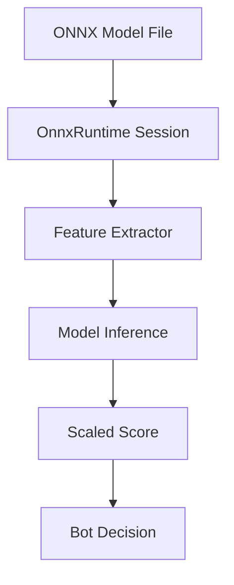

The Dice Chess engine supports **learned evaluation** via **ONNX (Open Neural Network Exchange)** models, enabling externally-trained value models to guide bot decision-making. This integration allows the engine to leverage machine learning models without embedding them in the codebase (models are passed as runtime files).

---

## Overview

ONNX integration provides two specialized bots:

1. **`OnnxEvalSearch`**: Uses ONNX model for leaf node evaluation in a shallow search
2. **`OnnxExpectimaxSearch`**: Combines ONNX evaluation with deep Expectimax search

Both bots are **JVM-only** (not available in JS/Wasm bundles due to ONNX Runtime dependency).

---

## Architecture



### Component Flow

1. **Model Loading**: ONNX model loaded via [ONNX Runtime Java API](https://github.com/microsoft/onnxruntime)
2. **Feature Extraction**: Board state converted to model input features via `OnnxFeatures`
3. **Inference**: Model evaluates position and returns win probability or score
4. **Integration**: Score combined with search algorithm's evaluation

---

## Feature Extraction

The engine implements several feature extractors in `shared/src/main/scala/dicechess/engine/search/`.
Each one is a versioned layout contract with a stable `schemaId`, and each is **mover-perspective and
dice-free**: `extract(state, color)` depends on the position and the color being scored, never on
which side is to move or on the current dice pool.

| `schemaId` | Columns | Extractor | Adds |
| --- | --- | --- | --- |
| `material-7-v1` | 7 | `OnnxFeatures` | piece-count differences, material difference and total |
| `rich-9-v1` | 9 | `RichFeatures` | `mobility_diff`, `king_safety_diff` |
| `rich-pdi-11-v1` | 11 | `RichPdiFeatures` | own/opponent piece-diversity indices |
| `kcp-13` | 13 | `KcpFeatures` | king and queen capture probabilities |
| `kcp-mobility-27-v1` | 27 | `KcpMobilityFeatures` | per-piece-type move counts, PDI |
| `kcp-mobility-pawns-31-v1` | 31 | `KcpMobilityPawnsFeatures` | passed-pawn columns |
| `raw-board-768-v1` | 768 | `RawBoardFeatures` | 12 piece planes × 64 squares |

The column names of each set are published as `columnNames` on the extractor, which is what training
enrichment writes its CSV header from — the layout has exactly one definition.

Cost, not width, decides where a set belongs: the four capture-probability columns of `kcp-13` each
integrate over the 216 dice outcomes of the next roll, which is affordable per root candidate and not
per chance-node leaf.

> [!NOTE]
> A model declares which schema it was trained on in its manifest, and the engine resolves that id
> back to the extractor — see [Model Serving Contract](/dicechess-engine/architecture/search/10-model-contract/).

---

## Bot Implementations

### OnnxEvalSearch

A **single-turn bot** that scores candidate turns with an ONNX model instead of a hand-tuned
heuristic. Model path and feature extractor are constructor arguments; the extractor defaults to
`OnnxFeatures.extract`:

```scala
val bot = new OnnxEvalSearch("/path/to/model.onnx", KcpFeatures.extract)
```

**Algorithm (untimed)**:
1. Generate all legal turn paths
2. Score every resulting position through the model
3. Return a highest-scoring turn, preferring the shortest immediate king capture

**Algorithm (under a deadline)**:
1. Pre-score candidates with material, which takes an immediate king capture for free
2. Score the remaining candidates through the model in batches, checking the clock between batches
3. Return the best candidate scored so far — or, if the deadline left no batch time to run, the
   material pick, so the anytime contract still returns a legal turn

### OnnxExpectimaxSearch

A **configurable two- or three-ply search bot** (Level 9) that combines ONNX evaluation with Expectimax lookahead:

```scala
val bot = OnnxExpectimaxSearch(
  modelPath = "/path/to/model.onnx",
  config = ExpectimaxConfig(candidateLimit = 8, searchDepth = 2),
  extractFeatures = RichFeatures.extract,
  preRankWithModel = true
)
```

**Algorithm**:
1. Pre-rank legal root turns (with material balance, or with the ONNX model when `preRankWithModel = true`)
2. Expand top `candidateLimit` candidates through 56 unique dice rolls
3. With `searchDepth = 3`, recursively expand our next roll and best legal reply after each opponent turn
4. At leaf decision nodes, evaluate positions in batches using the ONNX model
5. Return the best move from Expectimax search

**Performance**: the default depth 2 typically takes ~100-500ms per move (depending on model complexity, `candidateLimit`, and CPU). Exact depth 3 is orders of magnitude more expensive and is intended for generous time controls with Star pruning and a transposition table.

---

## Model Requirements

A conforming graph has exactly one input and one output, both FLOAT, both with a **dynamic batch
axis** — the search scores a whole chance node in a single call:

| | Name | Shape |
| --- | --- | --- |
| input | `input` (or the manifest's `inputName`) | `[batch, featureCount]` |
| output | `output` (or the manifest's `outputName`) | `[batch, 1]` |

`featureCount` is the column count of the feature schema the model was trained on (see the table
above). The output is read as a probability in `[0, 1]` and scaled onto the search's integer score
axis, so a model must be bounded — an unbounded regression head relies on a clamp and loses
resolution where it matters.

The full contract — manifest fields, roles, validation order, and what is refused when — is
documented in [Model Serving Contract](/dicechess-engine/architecture/search/10-model-contract/).
`ModelPackage.load` performs every check before a position reaches the model, and
`OnnxModelContract.validate` checks the loaded graph against the manifest.

---

## Usage Examples

### JVM Integration

```scala
import dicechess.engine.domain.FenParser
import dicechess.engine.search.{OnnxEvalSearch, RichFeatures, ScoredSequence}
import scala.util.Using

// The model path and the feature extractor are constructor arguments; the extractor
// defaults to OnnxFeatures.extract, so pass one only to override it.
Using.resource(OnnxEvalSearch("/models/dicechess_v1.onnx", RichFeatures.extract)) { bot =>
  // The dice roll is part of the position, not a separate argument
  val state = FenParser.parse(dfen).toOption.get.withDicePool(List(1, 2, 3))

  val best: Option[ScoredSequence] = bot.findBestMove(state)
}
```

`OnnxEvalSearch` owns a native onnxruntime session and is `AutoCloseable`, hence the `Using.resource`
— a long-lived host creates one instance per model and closes it on shutdown instead.

### From Command Line (Arena)

```bash
# Run arena with ONNX bot vs baseline
sbt 'arena/runMain dicechess.engine.bench.BotMatchRunner \
  --base-bot onnx-eval \
  --opponent greedy \
  --games 100 \
  --onnx-model /path/to/model.onnx'
```

### With Custom Model

```bash
# Using OnnxExpectimaxSearch
sbt 'arena/runMain dicechess.engine.bench.OnnxArenaRunner \
  /path/to/model.onnx \
  aggressive \
  100'
```

---

## Training Guidelines

While model training is outside the engine's scope, here are recommendations for compatible models:

### Recommended Approach

1. **Features**: Use `RichFeatures` or `KcpFeatures` as input
2. **Target**: Train to predict win probability (0-1) or centipawn advantage
3. **Data**: Generate from bot-vs-bot games using `TurnGenerator`
4. **Framework**: PyTorch → ONNX export, or scikit-learn → ONNX

### Example Training Pipeline

```python
# Pseudocode for training
import onnx
import onnxruntime as ort
from sklearn.neural_network import MLPClassifier

# 1. Extract features from positions
features, targets = extract_game_data(dfen_list, results)

# 2. Train model (sklearn example)
model = MLPClassifier(hidden_layer_sizes=(256, 128, 64))
model.fit(features, targets)

# 3. Export to ONNX
initial_type = [('float_input', FloatTensorType([None, 1200]))]
onnx_model = convert_sklearn(model, initial_types=initial_type)
with open("dicechess_model.onnx", "wb") as f:
    f.write(onnx_model.SerializeToString())
```

### Feature extraction stays in the engine

There is no Python reimplementation of a feature schema, and there should not be one: the engine is
the single source of truth for what a column means, so a second implementation is a second answer.
Training pipelines enrich their rows with the engine's own extractors and pin the agreement with a
golden corpus of probe vectors, which `Kcp13ParitySpec` replays from the engine side.

---

## Performance Considerations

### Inference latency

Session-run cost is dominated by per-call overhead (the JNI boundary and graph setup), not by the
number of rows, which is why every call site here is batched: folding N positions into one
`[N, F]` tensor is far cheaper than N runs of one row. `OnnxEvalSearch.onnxEvalBatch` is the
primitive, and the chance-node expansion deduplicates leaves by position before calling it.

For a feature set with capture-probability columns, extraction — not inference — is the budget:
each such column integrates over the 216 dice outcomes of the next roll.

### Memory Usage

- **Model in memory**: ~1-10MB (depends on model size)
- **ONNX Runtime overhead**: ~50MB
- **Session state**: ~1MB per concurrent session

---

## Dependency Management

The published `dicechess-engine_3` artifact marks `onnxruntime` as **optional** (`<optional>true</optional>`) so that rules-only callers do not carry the ~54 MB native library. Downstream ONNX consumers must declare the dependency directly in their own build, pinning version **`1.29.0`**:

```scala
// build.sbt (consumer)
libraryDependencies ++= Seq(
  "com.fortemate"          %% "dicechess-engine" % "<latest release>",
  "com.microsoft.onnxruntime" % "onnxruntime"    % "1.29.0"
)
```

The dependency is **JVM-only** and excluded from JS/Wasm compilation.

---

## Testing ONNX Integration

The engine includes a synthetic test model for validation:

```bash
# Test ONNX bot functionality
sbt "rootJVM/testOnly dicechess.engine.search.OnnxEvalSearchSpec"
```

Tests verify:
- Model loading from a classpath resource
- Single and batched inference agreeing, and perspective being honoured
- Score integration with the search, including the deadline path's material fallback
- Manifest, graph and digest rejections (`dicechess.engine.model.*`)

---

## Known Limitations

1. **JVM Only**: ONNX Runtime Java API not available for Scala.js/WebAssembly
2. **Model Size**: Large models (>50MB) may impact startup time
3. **Thread Safety**: ONNX Runtime sessions are thread-safe for inference but not for concurrent model loading
4. **Platform**: Requires Java 8+ (tested on Java 17+ and 25)

---

## See Also

- [Model Serving Contract](/dicechess-engine/architecture/search/10-model-contract/) — Manifests, roles, and what is refused
- [Expectimax Search Engine](/dicechess-engine/architecture/search/06-expectimax-search/) — Deep search with chance nodes
- [Bot Arena](/dicechess-engine/architecture/search/03-search-roadmap/) — Testing bot strength
- [Primitive Bot Strategies](/dicechess-engine/architecture/search/01-primitive-search/) — Heuristic-only bots for comparison
- [JVM API Reference](/dicechess-engine/architecture/jvm-api/) — Java/Kotlin integration
