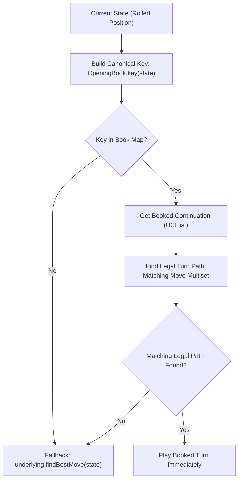

The **Opening Book** provides pre-computed turn sequences for common opening positions, allowing bots to play strong opening moves instantly without spending search budget.

In Dice Chess, opening book coverage is particularly valuable because the branching factor is high (often hundreds of legal turn paths per dice roll), while empirical game data from master play provides rich, reliable continuations.

---

## Format & Contract

Opening books are stored in plain **TSV (tab-separated values)** format. Each non-empty line maps a canonical position-and-dice key to a recommended turn continuation:

```text
<canonical-key>\t<continuation>
```

### Canonical Key (`OpeningBook.key`)

A book key identifies a specific board position together with the rolled dice pool:

```text
<piece-placement> <active-color> <castling> <en-passant> <dice>
```

1. **First 4 Fields (Normalized FEN)**: The canonical 4-field FEN from `Dfen.normalizedFen` (byte-compatible with the analytics database `normalized_fen` column):
   - Piece placement, active color (`w` or `b`), castling rights (`KQkq` or `-`), and canonical en-passant target square (retained only if actually capturable).
   - Half-move clock and full-move counter are **omitted** so positions that differ only by move counters share the same book entry.
2. **5th Field (`<dice>`)**: The rolled piece letters (`P N B R Q K`), sorted alphabetically and cased by the active player — uppercase for White, lowercase for Black (matching the analytics `dice_sorted` column).

### Continuation Value

The value mapped to a key is a comma-separated list of long-algebraic (UCI) micro-moves (e.g. `e2e4,f1c4`, with a promotion suffix such as `e7e8q` where applicable).

### Realistic TSV Example

```text
rnbqkbnr/pppppppp/8/8/8/8/PPPPPPPP/RNBQKBNR w KQkq - BPR	e2e4,f1c4
rnbqkbnr/pppppppp/8/8/8/8/PPPPPPPP/RNBQKBNR w KQkq - BKP	e2e4,e1e2
rnbqkbnr/pppp1ppp/8/4p3/4P3/8/PPPP1PPP/RNBQKBNR b KQkq - bpr	e8e7,d7d5
```

> [!IMPORTANT]
> **Cross-Repository Invariant**: The `OpeningBook.key` contract is shared across the Dice Chess ecosystem (the engine, `dicechess-analytics`, and the play platform). Any change to the key format is a breaking cross-repository event.

---

## Book Provenance & Exporting

The engine itself does not generate opening books. Opening books are produced from the historical games database by the `dicechess-analytics` backend:

```bash
# In the dicechess-analytics repository:
mise run db:export-book [minGames] [minRating] [outputPath]

# Example: Export book from games with rating >= 2000 and at least 100 observations
mise run db:export-book 100 2000 opening_book.tsv
```

Opening book data files are kept locally and are git-ignored (`opening_book.tsv`, `*.book.tsv`) — never commit data files to the engine repository.

---

## Book Bot Implementation

### Parsing & Decoration

The engine provides `OpeningBookParser` and `OpeningBookBot`:

- **`OpeningBookParser.parse(tsvString)`**: Validates and parses TSV data into a `Map[String, String]`, returning an `Either[Exception, Map[String, String]]`.
- **`OpeningBookBot.decorate(underlying, book)`**: Wraps any base `SearchAlgorithm` with opening book lookups.
  - If `underlying` implements `TimeBudgetedSearch`, `decorate` returns a `TimeBudgetedOpeningBookBot` so wall-clock deadlines are forwarded to the fallback bot on a book miss.
  - Draw and doubling decisions delegate directly to the underlying bot if it implements `DrawOfferLogic`.

### Lookup Algorithm



1. **Key Generation**: `OpeningBook.key(state)` constructs the canonical key. If no dice pool is set, lookup returns `None`.
2. **Map Lookup**: The key is checked against `book: Map[String, String]`.
3. **Multiset Matching**: The booked UCI micro-moves are compared against all legal turn paths from `TurnGenerator.generateAllLegalTurnPaths(state)` by **move multiset signature** (`moves.sorted.mkString(",")`).
   - The stored move order does not matter.
   - If the booked moves cannot be realised legally (e.g. from an incompatible or corrupted book), the entry is silently ignored in favour of the fallback bot rather than making an illegal move.
4. **Fallback**: On a book miss or illegal book move, `underlying.findBestMove(state)` executes normally.

---

## Usage Examples

### Scala (JVM)

```scala
import dicechess.engine.search.{BotInfo, BotRegistry, OpeningBookBot, OpeningBookParser}
import scala.io.Source

val source    = Source.fromFile("opening_book.tsv")
val tsvString = try source.mkString finally source.close()

val book     = OpeningBookParser.parse(tsvString).fold(error => throw error, identity)
val baseBot  = BotRegistry.getAlgorithm("aggressive").get
val decorated = OpeningBookBot.decorate(baseBot, book)

val registration = BotRegistry.registerCustomBot(
  BotInfo(
    id = "aggressive-book",
    name = "Aggressive + Book",
    description = "Aggressive bot decorated with an opening book",
    difficulty = 5,
    isExperimental = true
  ),
  decorated
)

// When the bot is no longer needed:
registration.close()
```

### JavaScript / TypeScript (Scala.js)

The JavaScript API exposes `registerOpeningBookBot` on `DiceChess`:

```typescript
import { DiceChess } from '@fortemate/dicechess-engine';

const tsvString = "rnbqkbnr/pppppppp/8/8/8/8/PPPPPPPP/RNBQKBNR w KQkq - BPR\te2e4,f1c4\n";

const ok = DiceChess.registerOpeningBookBot(
  tsvString,
  "aggressive",       // base bot ID
  "aggressive-book",  // new custom bot ID
  "Aggressive + Book" // new bot display name
);

if (ok) {
  const result = DiceChess.getBestMove(dfen, { algorithm: "aggressive-book" });
  console.log("Book turn:", result.moves);
}
```

### Bot Arena Runner (JVM)

Pits a base bot against the same bot decorated with an opening book to evaluate book performance:

```bash
sbt 'arena/runMain dicechess.engine.bench.OpeningBookArenaRunner \
  --base-bot aggressive \
  --book opening_book.tsv \
  --games 50'

# Or via mise task:
mise run arena:book aggressive opening_book.tsv 50
```

---

## Roadmap & Future Enhancements

Future opening book capabilities are tracked in the [Search Roadmap & Evaluation](/dicechess-engine/architecture/search/03-search-roadmap/):

1. **In-Engine Book Distillation**: Generating opening books directly via self-play without relying on external databases.
2. **Weighted Multi-Line Selection**: Supporting probabilistic selection across multiple viable continuations for the same opening key.
3. **Binary Serialization**: Compact binary formats for large opening books.

---

## See Also

- [Expectimax Search Engine](/dicechess-engine/architecture/search/06-expectimax-search/) — Configurable two- or three-ply lookahead for out-of-book positions
- [Time Management](/dicechess-engine/architecture/search/05-time-management/) — Budget allocation and deadline forwarding
- [Search Roadmap & Evaluation](/dicechess-engine/architecture/search/03-search-roadmap/) — Staged plans for future search and book optimizations
