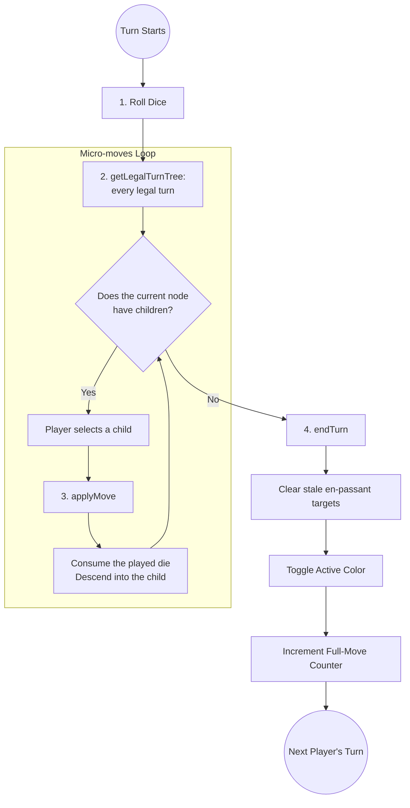

Unlike standard chess where a turn is a single, atomic action (moving one piece), a **Dice Chess** turn is an extended sequence with multiple distinct phases. This architectural choice is driven by the physical rules of the game (rolling three dice and playing up to three micro-moves).

This document outlines the conceptual lifecycle of a turn and how it maps to the Engine API and internal `GameState`.

## The Turn Lifecycle Diagram

## 1. Roll Dice (Start of Turn)

At the beginning of a turn, the active player rolls three standard 6-sided dice.
In the engine, this translates to filling the three dice slots of the `GameFlags` object.

* **DFEN Representation**: If White rolls three pawns, the 7th field of the DFEN string becomes `PPP`.
* **API Entry**: The JavaScript API takes the dice inside the DFEN, never as a separate argument. `getLegalTurnTree(dfen)` and `getLegalUciMoves(dfen)` read them from the 7th field, as in `rnbqkbnr/pppppppp/8/8/8/8/PPPPPPPP/RNBQKBNR w KQkq - 0 1 PPP`.

## 2. Generate and Filter Legal Turns

With the dice rolled, the engine calculates all pseudo-legal moves for the pieces matching the dice outcomes.
Crucially, the engine then applies the **Maximum Micro-moves Rule** (see [Maximum Micro-moves Rule Algorithm](./move-generation/05-maximum-micromoves)).

Any path that does not consume the maximum possible number of dice (or capture the King) is filtered out. Whether a micro-move is legal therefore depends on the whole turn, and the JavaScript API answers at two levels:

* `getLegalTurnTree(dfen)` returns every legal turn as a prefix tree of micro-moves. A node with no children is a complete turn; a turn that captures the King always ends at such a leaf.
* `getLegalUciMoves(dfen)` returns the legal first micro-moves, which are exactly the first level of that tree.

`getLegalUciMoves` judges the position it is given in isolation. Called again after a micro-move, it applies the rule afresh to the new position and the dice left in it, and no longer knows how many dice the whole turn could have used. The two answers agree on the first action, and can differ after it when a first action is legal only because a later one captures the King:

| Step | `getLegalUciMoves` on the current DFEN | The turn tree |
| :--- | :--- | :--- |
| Start: `8/8/8/2k5/8/1N6/2P5/K7 w - - 0 1 NPP` | `b3a5 b3c1 b3c5 b3d2 b3d4 c2c3 c2c4` | the same seven |
| After `c2c4`, dice `PN` left | `b3a5 b3c1 b3c5 b3d2 b3d4` | `b3c5` only |

After `c2c4` a quiet knight move would end a two-dice turn, while `c2c3, c3c4, Nb3xc5` spends all three dice: `c2c4` is legal only as the start of `c2c4, Nb3xc5`. A client that follows a turn one action at a time must walk the tree rather than call `getLegalUciMoves` after each micro-move.

## 3. The Micro-moves Loop (`applyMove`)

A player executes their turn incrementally.
Each time they make a move, the engine performs a **micro-move**:

* It updates the piece placements (using Bitboards and the Mailbox).
* It updates castling rights or adds a new *en-passant* target if a pawn was double-pushed.
* It removes the corresponding die from the dice pool; castling removes both the King and the Rook die. The DFEN that `applyMove` returns carries the dice that are left.

A client that walks the tree plays one of the current node's keys with `applyMove` and descends into that key's child. When the child is empty, the turn is complete.

> [!WARNING]  
> **Color Preservation:** During `applyMove`, the active color **does not change**. If White plays their first micro-move, the resulting state still belongs to White.

## 4. Formal Turn Completion (`endTurn`)

Once the player reaches a leaf of the turn tree — the dice are spent, or no further legal micro-move exists — the turn must be explicitly terminated. A turn that captured the King ends the game instead, so no `endTurn` follows it.

The orchestrator (e.g., the PWA frontend or the Search Bot) must invoke `DiceChess.endTurn(fen)`. 
This function is responsible for the critical **state transition boundary**:

1. **Active Color Toggle**: The active color switches to the opponent (e.g., White $\rightarrow$ Black).
2. **Move Counter**: The `fullMoveNumber` increments if the completing player was Black.
3. **Stale En-Passant Cleanup**: This is uniquely vital in Dice Chess. Since a player can push multiple pawns in one turn, multiple en-passant targets can exist. When the player *ends* their turn, any en-passant targets they created *on their previous turn* (which the opponent had a chance to capture but didn't) are wiped out. The targets they just created in *this* turn are preserved for the opponent's upcoming turn.
