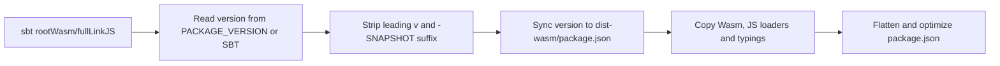

The Dice Chess Engine is a **cross-platform library** compiled for both the JVM and JavaScript targets via **Scala.js**. To accommodate different client environments and performance requirements, the engine is compiled and published as two separate npm packages:

1. **[`@fortemate/dicechess-engine`](https://www.npmjs.com/package/@fortemate/dicechess-engine)** — A pure JavaScript build (ES Module) optimized for synchronous execution.
2. **[`@fortemate/dicechess-engine-wasm`](https://www.npmjs.com/package/@fortemate/dicechess-engine-wasm)** — A WebAssembly (Wasm) build featuring full support for computation-heavy search workloads.

Install either package directly from npmjs.org. No token or custom `.npmrc` is required:

```bash
npm install @fortemate/dicechess-engine
# or
npm install @fortemate/dicechess-engine-wasm
```

The same names and versions are mirrored to GitHub Packages. That mirror requires a GitHub Packages
read token and an `@fortemate:registry=https://npm.pkg.github.com` scope mapping; it is not the default
installation path.

JVM backends consume the engine via the [Maven artifact](/dicechess-engine/guidelines/maven-artifact/) instead.

---

## Package Comparison & Guidelines

To select the most appropriate package for your application, consult the comparison table and recommendations below.

### Comparison Table

| Attribute | Pure JS (`@fortemate/dicechess-engine`) | WebAssembly (`@fortemate/dicechess-engine-wasm`) |
| :--- | :--- | :--- |
| **Compiled Files** | `dicechess-engine.js`, `dicechess-rules.js`, `internal-<hash>.js`, `dicechess-engine.d.ts`, `dicechess-rules.d.ts` | `main.js`, `main.wasm`, `main.wasm.map`, `__loader.js`, `dicechess-engine.d.ts` |
| **Entry points** | `.` (everything) and `./rules` (rules only) | `.` only — the Wasm backend emits a single module |
| **Initialization** | Synchronous API after ES module loading | Asynchronous initialization through a JavaScript loader and WasmGC |
| **Runtime requirement** | Compatible JavaScript runtime | JavaScript runtime with WasmGC support |

Bundle sizes and execution times vary by release, runtime and workload. Use the
[benchmark guide](/dicechess-engine/guidelines/js-wasm-benchmarks/) to compare the actual
packages you intend to deploy.

### When to use which package?

* **Use `@fortemate/dicechess-engine/rules`** for basic rules operations and board tooling
  that do not need complete turn trees or bots. It does not export `getLegalTurnTree` or
  `getPlayableDice`.
* **Use `@fortemate/dicechess-engine`** for interactive games following a full legal turn
  tree and for built-in bots. `applyMove` transforms state; it is not a complete legality
  check. A client must follow the tree throughout the turn.
* **Consider `@fortemate/dicechess-engine-wasm`** for a WasmGC-compatible runtime after
  measuring your workload. It has the same full facade and no `./rules` subpath.

Use a Web Worker or the host runtime's equivalent when search would block input.
The default npm bots include Monte-Carlo, but not expectimax or JVM-only ONNX searches.
See the [integration guide](/dicechess-engine/guides/integrations/) for browser and TV examples.

---

## Packaging Lifecycle Tasks

Four `mise` tasks manage the packaging and distribution lifecycle:

| Task | Description |
| :--- | :--- |
| `mise run package:prepare` | Build optimized pure JavaScript package, assemble the `dist/` directory, and check both entries (`.` and `./rules`) with `.mise/lib/check-npm-package-entries.mjs` |
| `mise run package:prepare-wasm` | Build optimized WebAssembly package and assemble the `dist-wasm/` directory |
| `mise run package:verify` | Dry-run both tarballs, validate their exact contents and metadata, install them into clean temporary projects, and import their entry points |
| `mise run package:clean` | Remove both the `dist/` and `dist-wasm/` directories |

---

## What `package:prepare-wasm` Does

Similar to the pure JS packaging script, `.mise/tasks/package/prepare-wasm` packages the Scala.js WebAssembly target for distribution:



1. **Compiles Wasm Target** — Depends on `wasm:build`, which runs `sbt rootWasm/fullLinkJS` to compile Scala.js to WebAssembly. This generates the `main.wasm` bytecode, a `main.js` ES Module wrapper, and the `__loader.js` loader module.
2. **Synchronizes versioning** — Uses `PACKAGE_VERSION` if provided (or queries sbt version), strips any leading `v` and the `-SNAPSHOT` suffix, then updates `dist-wasm/package.json`.
3. **Flattens the output structure** — Copies the Wasm binary and supporting files into a clean `dist-wasm/` directory.
4. **Optimizes package configuration** — Adjusts paths in `dist-wasm/package.json` to flat-level references so the module exports are correctly resolved when published.

---

## Downstream WebAssembly Integration Guide

Because bundlers (like Vite) struggle to resolve `.wasm` files dynamically loaded inside Web Workers when shipped inside `node_modules`, downstream frontends (like SvelteKit) should follow this integration pattern:

### 1. Copy Wasm Assets as Static Files
Create a pre-build script (e.g. `scripts/copy-wasm.mjs`) to copy the engine's Wasm runtime into a static asset directory:

```javascript
// scripts/copy-wasm.mjs
import { mkdir, copyFile } from 'node:fs/promises';
import { dirname, join } from 'node:path';
import { fileURLToPath } from 'node:url';

const root = dirname(dirname(fileURLToPath(import.meta.url)));
const src = join(root, 'node_modules', '@fortemate', 'dicechess-engine-wasm');
const dest = join(root, 'public', 'engine-wasm');
const files = ['main.js', 'main.wasm', 'main.wasm.map', '__loader.js'];

await mkdir(dest, { recursive: true });
for (const file of files) {
  await copyFile(join(src, file), join(dest, file));
}
console.log(`Copied ${files.length} engine WASM files to public/engine-wasm/`);
```

### 2. Dynamically Import Wasm inside Web Worker
Scala.js Wasm uses top-level await to compile. Load the engine dynamically inside the Worker thread so it doesn't block worker initialization or drop incoming messages:

```javascript
// public/mc-worker.js
let enginePromise;
const loadEngine = () => (enginePromise ??= import(`${location.origin}/engine-wasm/main.js`));

self.onmessage = async (event) => {
  if (event.data.type === 'start') {
    const engine = await loadEngine();
    // Run CPU-intensive Monte-Carlo equity estimation
    const result = engine.estimateEquity(event.data.dfen, { rollouts: 100 });
    self.postMessage({ type: 'result', data: result });
  }
};
```

---

## Local Integration Testing

To test engine changes in a downstream project (e.g. `dicechess-analytics-ui`) **before** publishing a release:

```bash
# 1. Build local packages in dicechess-engine
mise run package:prepare
mise run package:prepare-wasm

# 2. Link to local builds in your frontend project
cd ../dicechess-analytics-ui
npm link ../dicechess-engine/dist
npm link ../dicechess-engine/dist-wasm

# 3. Run frontend development server
npm run dev
```

:::tip
After linking, the frontend's imports resolve to your local `dist/` or `dist-wasm/` folders. Any changes you make to the engine and re-compile are immediately reflected.
:::

### Unlinking

To revert to the published registry versions:

```bash
cd ../dicechess-analytics-ui
npm unlink @fortemate/dicechess-engine
npm unlink @fortemate/dicechess-engine-wasm
npm install
```
